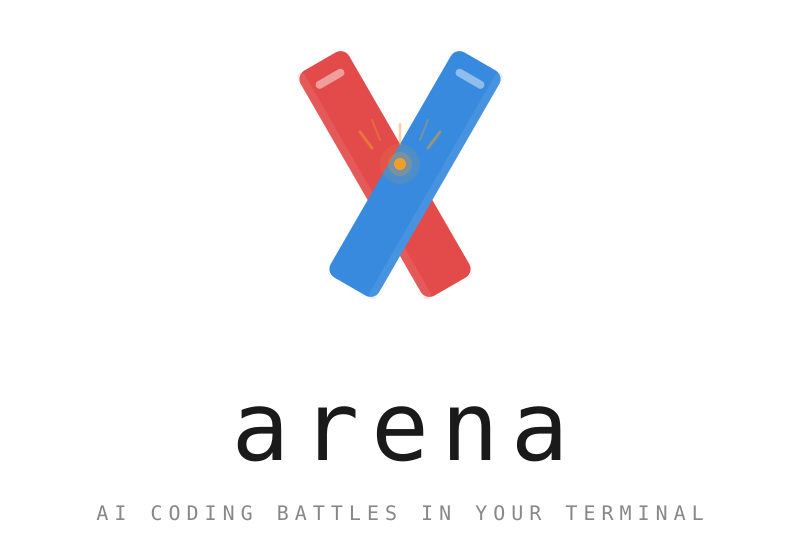
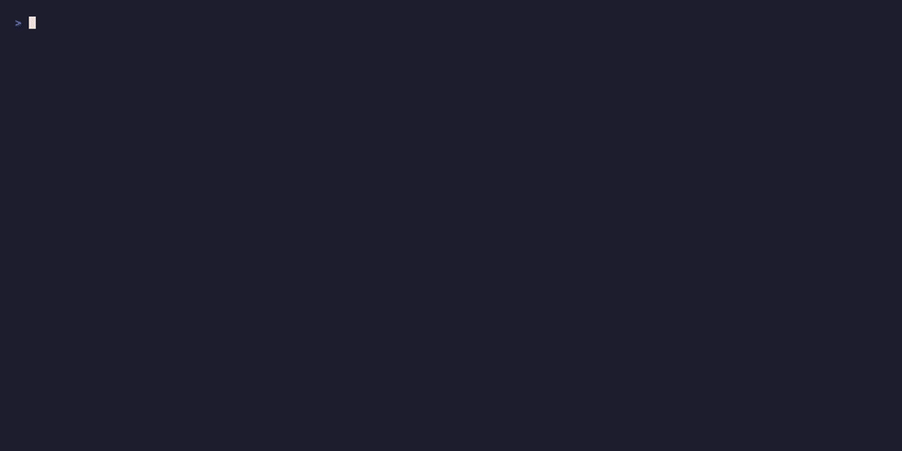

<p align="center">
  <picture>
    <source media="(prefers-color-scheme: dark)" srcset="assets/arena-logo-dark.png" />
    <source media="(prefers-color-scheme: light)" srcset="assets/arena-logo-light.png" />
    
  </picture>
</p>

<p align="center">
  <strong>AI coding battles in your terminal. Two models. One challenge. The best code wins.</strong>
</p>

<p align="center">
  <a href="#quick-start">Quick Start</a> &bull;
  <a href="#battle">Battle</a> &bull;
  <a href="#tournament">Tournament</a> &bull;
  <a href="#bench">Bench</a> &bull;
  <a href="#generate">Generate</a> &bull;
  <a href="#challenge-packs">Packs</a> &bull;
  <a href="#global-leaderboard">Leaderboard</a>
</p>

<p align="center">
  
  
  
  
</p>

---

<p align="center">
  
</p>

---

## Why Arena?

You've read the benchmarks. You've seen the vibes. But **which model actually writes better code?**

Arena settles it. Pick two models, pick a challenge, and watch them code side by side in your terminal. Real code. Real tests. Real scores. Or run a full tournament across every model you have.

```bash
arena battle fizzbuzz --left claude --right gpt4o
```

No opinions. No vibes. Just code that works.

## Quick Start

```bash
# Install
npm install -g arena-cli

# Battle with cloud models
export ANTHROPIC_API_KEY=sk-ant-...
export OPENAI_API_KEY=sk-...
arena battle fizzbuzz --left claude --right gpt4o

# Battle with local models (free, no API keys)
ollama pull qwen2.5-coder:7b
ollama pull deepseek-coder-v2
arena battle fizzbuzz --left qwen --right deepseek

# Run a tournament
arena tournament --models qwen,deepseek,smollm --challenges fizzbuzz,lru-cache,binary-search

# Benchmark a single model
arena bench qwen --json

# Generate a challenge from a description
arena generate "build a redis clone"
```

## How It Works

```
┌──────────────────────────────────────────────────────┐
│  1. Challenge prompt sent to both models              │
│  2. Code streams live in split-pane terminal view     │
│  3. Markdown fences stripped, code extracted           │
│  4. Both solutions executed in sandboxed processes     │
│  5. Test suite runs against both outputs              │
│  6. Scores calculated (tests 60% + speed + brevity)   │
│  7. ELO updated, battle saved to ~/.arena/            │
└──────────────────────────────────────────────────────┘
```

<!-- GIF PLACEHOLDER: Split-pane streaming view -->
<!-- Replace with:  -->

### Scoring

| Component | Weight | What It Measures |
|-----------|--------|-----------------|
| Tests passed | 60% | Correctness — does the code actually work? |
| Generation speed | 15% | How fast the model responds |
| Code brevity | 10% | Conciseness — fewer lines for the same result |
| Qualitative checks | 15% | Patterns like type hints, docstrings, thread safety |

---

## Commands

### Battle

Run a head-to-head battle between two models.

```bash
arena battle lru-cache --left claude --right gpt4o
arena battle --random --left claude --right gpt4o
arena battle ./my-challenge.json --left claude --right gpt4o

# Multi-round for statistical rigor (recommended)
arena battle fizzbuzz --left claude --right gpt4o --rounds 5
```

<!-- GIF PLACEHOLDER: Battle scoreboard -->
<!-- Replace with:  -->

Multi-round battles implement the **pass@k** metric from [Chen et al. 2021](https://arxiv.org/abs/2107.03374). Each round independently generates, executes, and tests code. The winner is determined by average score across all rounds:

```
⚔  RESULTS  fizzbuzz (5 rounds)
━━━━━━━━━━━━━━━━━━━━━━━━━━━━━━━━━━━━━━━━━━━━━━━━━━━━

 claude ★ WINNER                │  gpt4o

  Score                             Score
  █████████████████░░░ 88.3         █████████████░░░░░░░ 71.2

  Tests    5/5 (best)               Tests    5/5 (best)
  ELO      +17                      ELO      -17

  pass@k                            pass@k
    pass@1  80%                       pass@1  60%
    pass@5  100%                      pass@5  99%

  Rounds                            Rounds
  ● ● ◐ ● ●                        ● ○ ● ◐ ●
    R 1: 5/5 (92.5)                   R 1: 5/5 (78.1)
    R 2: 5/5 (88.0)                   R 2: 0/5 (52.3)
    R 3: 4/5 (74.1)                   R 3: 5/5 (81.0)
    R 4: 5/5 (91.2)                   R 4: 4/5 (68.4)
    R 5: 5/5 (95.8)                   R 5: 5/5 (76.3)
```

### Tournament

Run a round-robin tournament between multiple models. Every pair plays every challenge.

```bash
arena tournament --models qwen,deepseek,smollm --challenges fizzbuzz,lru-cache --rounds 3
arena tournament --models claude,gpt4o,gemini --challenges all
```

```
🏆  arena tournament
  Models:     qwen, deepseek, smollm
  Challenges: 3
  Matches:    9 (3 pairs × 3 challenges)

  [1/9] qwen vs deepseek on fizzbuzz...     ←  92.5-76.0
  [2/9] qwen vs smollm on fizzbuzz...       ←  88.3-22.1
  [3/9] deepseek vs smollm on fizzbuzz...   ←  85.0-18.4
  ...

  Final Standings
  #   Model       Pts    W     L     D     Avg
  ─────────────────────────────────────────────
  🥇1 qwen         18     6     0     0     85.2
  🥈2 deepseek     9      3     3     0     72.1
  🥉3 smollm       0      0     6     0     28.4
```

### Bench

Benchmark a single model against all (or selected) challenges. Designed for CI/CD pipelines.

```bash
# Human-readable output
arena bench qwen --challenges fizzbuzz,binary-search,lru-cache --rounds 5

# JSON for CI pipelines
arena bench claude --json > results.json

# Fail CI if pass rate drops below threshold
arena bench claude --json --exit-code --threshold 0.8
```

```json
{
  "model": "claude-sonnet-4-20250514",
  "total_challenges": 20,
  "total_tests": 102,
  "total_passed": 94,
  "overall_pass_rate": 0.922,
  "pass_at_k": { "pass@1": 0.88, "pass@5": 0.96 },
  "per_challenge": [ ... ]
}
```

**GitHub Actions example:**

```yaml
- name: Benchmark model
  run: |
    arena bench claude --json --exit-code --threshold 0.8
```

### Generate

Generate a challenge from a natural language description using any LLM.

```bash
arena generate "implement a LRU cache with O(1) operations"
arena generate "build a URL shortener" --language javascript --difficulty hard
arena generate "implement a priority queue" --run   # generate + immediately battle
```

```
⚡  arena generate
  Prompt:     implement a stack with push, pop, peek, and is_empty
  Model:      qwen
  Language:   python
  Difficulty: medium

  Generating challenge... done (2.6s)

  Stack with Push, Pop, Peek, and Is Empty Methods [medium]
  ID:    stack
  Tests: 5
  Saved: ~/.arena/generated/stack.json

  • push
  • pop
  • peek
  • is_empty
  • pop from empty stack
```

Generated challenges are automatically available in `arena list` and `arena battle`.

### Challenge Packs

Install community challenge packs to expand beyond the 20 built-in challenges.

```bash
# Install from a local file
arena install ./my-challenges.json

# Install from GitHub
arena install github:username/arena-pack-leetcode

# List installed packs
arena install
```

Packs are validated on install and automatically show up in `arena list` and `arena battle`.

### Global Leaderboard

Publish battle results to the global leaderboard and see how models rank worldwide.

```bash
# Publish all unpublished battles
arena publish

# Publish a specific battle
arena publish battle-2026-03-22-abc123

# View global rankings
arena leaderboard --global
```

<!-- ELO LEADERBOARD EMBED PLACEHOLDER -->
<!-- Replace with a screenshot or live embed showing global rankings -->
<!-- Example:  -->

### Other Commands

```bash
arena list                  # List all challenges (builtin + packs + generated)
arena leaderboard           # Local ELO rankings
arena replay <battle-id>    # Re-render a past battle
arena config                # View configuration
```

---

## Challenges

20 built-in challenges across 4 categories:

| Category | Challenges | Examples |
|----------|-----------|---------|
| **Algorithms** | 5 | FizzBuzz, Binary Search, LRU Cache, Merge Intervals, Rate Limiter |
| **Data Structures** | 5 | KV Store with TTL, Linked List, Priority Queue, Trie, Graph BFS |
| **Web** | 5 | REST CRUD, JWT Auth, URL Shortener, Webhooks, SSE |
| **CLI Tools** | 5 | CSV Parser, Log Analyzer, File Dedup, Markdown TOC, JSON Flatten |

**Expand with:**
- `arena generate "your idea"` — AI-generated challenges
- `arena install <pack>` — community challenge packs
- Custom JSON files — `arena battle ./my-challenge.json`

### Custom Challenge Format

```json
{
  "id": "my-challenge",
  "title": "My Custom Challenge",
  "category": "algorithms",
  "difficulty": "medium",
  "prompt": "Write a function that...",
  "language": "python",
  "tests": [
    { "name": "basic test", "setup": "", "run": "result = my_function(42)", "assert": "result == 'expected'" }
  ],
  "qualitative_checks": [
    { "id": "type-hints", "patterns": ["def .+\\(.*:.*\\).*->"] }
  ]
}
```

## Supported Models

### Cloud (API key required)

| Alias | Model | Provider |
|-------|-------|----------|
| `claude` | claude-sonnet-4-20250514 | Anthropic |
| `claude-opus` | claude-opus-4-20250514 | Anthropic |
| `gpt4o` | gpt-4o | OpenAI |
| `gemini` | gemini-2.5-pro | Google |

### Local (free, via Ollama)

| Alias | Model |
|-------|-------|
| `qwen` | qwen2.5-coder:1.5b |
| `deepseek` | deepseek-coder-v2 |
| `llama3` | llama3.3 |
| `smollm` | smollm2:135m |

Any Ollama model works with the `ollama:model-name` syntax:

```bash
arena battle fizzbuzz --left ollama:codestral --right ollama:qwen2.5-coder:32b
```

## ELO Rating System

Arena maintains a local ELO rating for every model you test:

- New models start at **1200**
- K-factor of **32** (same as chess for new players)
- Wins, losses, and draws all update ratings
- Draws (scores within 2 points) cause no change
- All ratings stored in `~/.arena/elo.json`

<!-- ELO CHART EMBED PLACEHOLDER -->
<!-- Replace with:  -->

## Data Storage

Everything is stored locally in `~/.arena/`:

```
~/.arena/
  config.json              # API keys, aliases, defaults
  elo.json                 # ELO ratings for all models
  battles/                 # Battle results (3-10KB each)
  tournaments/             # Tournament results
  generated/               # AI-generated challenges
  packs/                   # Installed challenge packs
```

## Development

```bash
git clone https://github.com/YOUR_USERNAME/arena.git
cd arena
npm install
npm link

# Run tests
npm test                    # All 233 tests
npm run test:unit           # 178 unit tests
npm run test:integration    # 32 integration tests
npm run test:uat            # 23 UAT tests
npm run test:verbose        # Detailed Jest output
npm run test:coverage       # With coverage report
```

### Architecture

```
src/
  commands/        # CLI command handlers (battle, bench, tournament, generate, install, publish)
  models/          # LLM provider adapters (Anthropic, OpenAI, Google, Ollama)
  engine/          # Battle orchestration, benchmarking, tournament runner, challenge generator
  elo/             # ELO calculation and persistence
  packs/           # Challenge pack registry and management
  challenges/      # Built-in challenge definitions + validation
  ui/              # Ink (React) terminal UI components
  utils/           # Config, sandbox execution, SSE reader, timing, hashing, markdown stripping
api/
  src/             # Global leaderboard API (Cloudflare Worker + D1)
```

## FAQ

**Q: Is this expensive to run?**
Use Ollama for free local battles. Cloud APIs cost ~$0.01-0.10 per battle depending on the model and challenge complexity.

**Q: Can I add my own challenges?**
Three ways: `arena generate "description"`, `arena install <pack>`, or create a JSON file and pass it to `arena battle`.

**Q: Why do same-model battles produce different results?**
LLMs are non-deterministic at temperature > 0. Use `--rounds 5` for statistically meaningful comparisons.

**Q: Can I use this in CI/CD?**
Yes. `arena bench <model> --json --exit-code --threshold 0.8` returns non-zero if the model's pass rate drops below 80%.

**Q: Does arena send my code anywhere?**
Not by default. All execution is local. Only `arena publish` sends battle results to the global leaderboard (opt-in).

**Q: How does the tournament scoring work?**
3 points for a win, 1 for a draw, 0 for a loss. Ties broken by average score. Every model pair plays every challenge.

---

<p align="center">
  Made for developers who want to know which AI actually writes better code.
</p>
